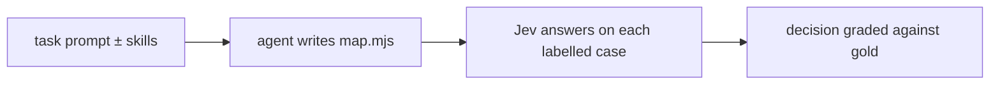

# Evaluations

The skills in this kit tell an agent to measure every Jev map on labelled cases. This page describes how the
skills themselves were measured, what the results were, and what changed because of them.

## Overview

| evaluation | question | size | result |
| --- | --- | --- | --- |
| [The study](#the-study) | Where does Jev win and lose, and why? | 57 suites, 1,836 cases | question wording moved accuracy 30–40 points; Jev +4.8 over a cheap LLM |
| [Design A/B](#design-ab) | Do agents with the skills avoid Jev's traps? | 76 agent runs | 8/8 traps avoided with the plugin, 1/8 without |
| [Accuracy on Jev](#accuracy-on-jev) | Do those maps score better? | 37 maps | not at first; after four new rules, 69.2% → 91.7% |
| [Held-out tasks](#held-out-tasks) | Does it transfer to new tasks and another model? | 53 maps | reply exposure 84–88% → 97–98%; a second task tied at 100%; a third was later used for tuning |
| [Rule probes](#rule-probes) | Do the rules hold in other domains? | 10 rules × 3 domains | 7 held, 2 held under their condition, 1 narrowed |
| [Other vendors' models](#other-vendors-models) | Does it work for models other than Claude? | 266 maps, 10 authoring models | pooled over tasks, wrong decisions fell or stayed at zero for every author; one-call authors lost some maps to unfinished output |
| [A hard task, and the latest models](#a-hard-task-and-the-latest-models) | Does the skill hold up where the task is hard? | 63 maps, 4 authors | wrong decisions 9.0% → 0.2–0.5%; v4.3 accuracy 99.3% for Claude Code, 96.5% for DeepSeek |
| [Policy outcomes](#policy-outcomes) | Does telling agents not to ask for a policy's outcome help? | 12 maps, 2 tasks | access requests 5 → 1 wrong in 90; the new task was at the ceiling |

## How a map is graded

A **map** is the code an agent writes: it builds the state, asks the questions, and turns Jev's answers into a
decision ([interface](../README.md#maps-and-suites)). Every eval after the study grades
whole maps end to end:



Each case ends in one of three outcomes:

- **right:** the decision matches the gold label.
- **wrong:** it doesn't. A wrong decision is acted on, so this rate matters most.
- **abstain:** the map sent the case to a person.

Accuracy is the share of right answers, so an abstention counts against it. Coverage is the share of cases
decided either way. The wrong-decision rate counts only decisions made and missed. Read the two together: a map
can cut wrong decisions by abstaining more, which costs people's time.

A map that produced no code or failed to load is a failure, not "0 wrong decisions". Tables below say which
rates cover only the maps that ran, and give paired figures (authors whose maps ran in both arms) where
failures differ between arms.

Across the program:

- **Bars were pre-registered.** Rubrics, hypotheses and pass bars were committed before any run.
- **Grading was blind** wherever both arms ran.
- **Gold labels were computed by rule** where possible, then audited by an independent model that saw the rule
  and the case, never the label.
- **Held-out suites came first.** They were committed before any agent wrote a map for them. A task later used
  to change the skill is reported as no longer held out.
- **Order is on record.** The research repository is private; the kit receives exported snapshots, so its own
  history can't show the order. These are the private commits, in time order:

| round | pre-registration committed | first results committed |
| --- | --- | --- |
| held-out, round 1 | `c92b716`, 25 Sep 16:50 UTC | `9d68b91`, 25 Sep 17:02 |
| round 2 | `f92e70f`, 26 Sep 15:55 | `cc89e7e`, 26 Sep 16:13 |
| round 2, skill v4 | `e94ed5e`, 26 Sep 16:39 | `6086077`, 27 Sep 04:45 |
| round 3 (v4.3 at `2e0d4ae`, 05:09) | `32d605f`, 28 Sep 05:08 | `eac5dc7`, 28 Sep 05:22 |
| round 4 | `6eb719c`, 28 Sep 07:54 | `6089418`, 28 Sep 13:04 |

  From this release on, the kit is published on every change, so future rounds show the order in its public history.
- **The grader changed once after results were seen.** In round 1 a map that returned a bare label instead of
  `{ field: label }` scored 0/30; `jev-run` was changed to accept a bare label when the gold has one field, and
  the map re-scored 30/30. This is recorded in that round's pre-registration.

## The study

57 hand-labelled decision suites (1,836 cases) were run on Jev and a cheap LLM (`zai/glm-5.3-flash`), and seven
of them on a frontier model (`openai/gpt-5.5-fast`, about 83× the cheap model's input price).

| measure | result |
| --- | --- |
| accuracy on decisions Jev is built for | +4.8 points over a cheap LLM; a tie with a frontier model |
| cost | 3–10× cheaper than the cheap LLM per decision on short states, up to ~100× with long states or LLM reasoning; 200–600× cheaper than the frontier model |
| latency | ~600 ms p50, ~1.05 s p95 through the gateway, against 2.9 s and 10 s |
| malformed output | 0 in ~1,900 calls |
| largest single effect | rewriting one question: 30–40 points |

This is where the rules come from. See [how the rules were derived](rules.md#how-the-rules-were-derived).

## Design A/B

Coding agents got tasks that each hide one trap whose cost the study had measured. They ran with and without
the plugin: 76 runs over seven rounds, graded blind against rubrics committed first.

| trap | with plugin | without |
| --- | ---: | ---: |
| a hidden comparison, or an asked-for action | **8/8** | 1/8 |
| compile several question drafts, score them, pin the winner | **3/3** | 0/3 |
| send the unsure cases to a person instead of allowing them | **19/19** | 7/19 |
| a missing premise, weighing trade-offs, many facts from one document | 14/14 | 14/14 |

The A/B found three gaps in the skills, and each fix was re-tested at 3/3 or better. One gap was guidance
placed in a skill the agent didn't load for that task. The fixes moved or sharpened existing rules rather than
adding new ones. [Raw runs and rubrics](../evals/plugin-ab).

## Accuracy on Jev

The same maps, run through Jev on labelled suites.

| task | no plugin | v1 (rounds 1–7) | v2 (round 10) | v3 (rounds 11–12) |
| --- | ---: | ---: | ---: | ---: |
| renewal notice: accuracy (wrong) | 69.2% (3.3%) | 56.9% (4.7%) | 58.3% (5.0%) | **91.7% (0%)** |
| CI retry: accuracy (wrong) | 80.0% (20.0%) | 76.1% (1.7%) | — | **85.6% (3.3%)** |
| culprit log line: accuracy (wrong) | 77.8% (13.3%) | 47.5% (**45.8%**) | **100% (0%)** | 86.7% (13.3%) |

4 maps or fewer per cell. The culprit re-check under v3 went back to 13.3% wrong: two of three maps picked a
failing test's name over its assertion, which their rubric allowed (an independent reviewer accepted it in 5 of
6 cases). In round 2, under a later version, Claude Code culprit maps made 0 wrong decisions in 90 against 12
without the plugin.

The first plugin made the culprit task worse. Agents applied a ranking rule to a picking task, and filtered
log lines with a regex that dropped the right one. Reading Jev's wrong answers produced four new rules:

| new rule | before → after |
| --- | --- |
| pick one of many with a `choice` | culprit wrong decisions 45.8% → 0% |
| measure a pre-filter's recall, or send everything | right line kept in 5/30 → 30/30 |
| split compound questions | 0.50–0.79 → 0.90–0.94 |
| read dates as year/month/day choices | "on time?" 64–75% → 30/30 |

An independent reviewer (GLM 5.3 Flash) agreed with 88 of the 90 labels. [Suites and results](../evals/plugin-accuracy).

## Held-out tasks

Three tasks the plugin was never built on, with suites committed before any map was written, plus 60
adversarial cases. Two agent models: Claude Code's default model at the time, and Sonnet.

| task | no plugin (normal / hard) | plugin (normal / hard) |
| --- | ---: | ---: |
| reply-exposure | 84–88% / 73–76% | **97–98% / 83–88%** |
| alert-routing | 100% / 100% | 100% / 99–100% |
| expense-review | 92–94% / 86–93% | **97–100% / 97–99%** |

Expense-review first went the wrong way: the plugin made 13.8% wrong decisions on hard cases, against 0%. Two
additions came from it: read a stated number exactly (now part of rule 9), and ask whether an expense
*includes* an excluded item (rule 7). After them, the default model's maps made 1 wrong decision in 200, and
Sonnet's final maps 3.3% on normal cases against 0% without the plugin. Because of those fixes, expense-review no
longer counts as held out. [Details](../evals/heldout/README.md).

## Rule probes

Ten rules were tested outside the tasks they came from. For each, the recommended wording and the wording it
warns against ran on 12 items in each of three new domains, with the truth known by construction. Only Jev
was called. The full table also reports [decisiveness](rules.md#how-the-rules-were-derived): 0 for a 50/50
answer, 1 for a certain one.

| outcome | rules |
| --- | --- |
| held in every domain | 1, 4, 5, 7, 9, 10, 15 |
| held under its condition | 2: naming the field mattered in the two domains where the state held other material |
| | 6: a compound question tied on accuracy, but lost decisiveness when the requirement took reasoning |
| narrowed | 8: two stated values compare fine; a value that must be computed doesn't (9/12 at 0.25) |

[Full table](../evals/rule-probes/README.md).

## Other vendors' models

Five new tasks, pre-registered, with labels audited by GLM 5.3 (119/119). Two kinds of author wrote maps:

- **Claude Code agents**, which can run and fix their map before finishing.
- **Nine other models**, each writing a map in a single API call with the skill text in the system prompt:
  GLM 5.3 and Qwen 3.8 Max on all five tasks, and a seven-model panel on three of them. The panel was GPT-5.6
  Terra, Gemini 3.8 Flash, DeepSeek V4 Pro, Kimi K3, Mistral Medium 3.5, MiniMax M3, and Muse Spark 1.3.

266 maps in total, every one graded on Jev.

**Pooled over tasks, wrong decisions fell or stayed at zero for every author.** Where authors lost maps to
unfinished output, the paired column counts only authors whose maps all ran in both arms:

| author | task | no plugin | plugin, maps that ran | paired |
| --- | --- | ---: | ---: | ---: |
| Claude Code agents | SLA breach | 14/90 (15.6%) | **1/90 (1.1%)** | same |
| Claude Code agents | culprit line | 12/90 (13.3%) | **0/90** | same |
| seven-model panel | SLA breach | 48/420 (11.4%) | 2/270 | 3/240 → 2/240 |
| seven-model panel | culprit line | 18/420 (4.3%) | **0/390** | 14/360 → **0/360** |
| seven-model panel | refund eligibility | 9/420 (2.1%) | 5/330 | 3/180 → **0/180** |
| GLM 5.3 and Qwen 3.8 Max | five tasks | 1.8–1.9% | **0–0.2%** | — |

Most of the panel's SLA improvement came from two authors (MiniMax M3 and Mistral Medium 3.5) whose plugin maps
didn't run; paired, it is 1.3% → 0.8%. The culprit and refund results hold paired. Per task, three cells went the
other way, from zero: Claude Code on access requests (0 → 2 of 90), GLM on access requests (0 → 1 of 90), and
Mistral on refunds (0 of 30 → 4 of 60). The pre-registered hypothesis was per task and author, so as written it failed in
those cells; the access-request cells led to the [policy-outcome](#policy-outcomes) fix.

**The first skill version made other models' maps abstain too often.** GLM's and Qwen's maps gated on questions
about the policy, on guessed thresholds, or on policy clauses re-read for every case. Four changes fixed this:
fit gates per question, never gate on the policy, pin a fixed policy in code, and narrow rule 8. Accuracy on
maps that ran then rose:

| author | no plugin | first version (v3) | v4.2 |
| --- | ---: | ---: | ---: |
| GLM 5.3 | 83.6% | 76.2% | **90.7%** |
| Qwen 3.8 Max | 95.3% | 79.7% | **90.8%** |
| Gemini 3.8 Flash | 58.9% | 93.3% | 92.8% |
| DeepSeek V4 Pro | 73.3% | 93.9% | 94.4% |
| GPT-5.6 Terra | 35.6% | 43.3% | — |
| Mistral Medium 3.5 | 61.1% | 50.0% | — |
| MiniMax M3 | 67.2% | 42.2% | — |

Accuracy on maps that ran. GLM and Qwen rows cover all five tasks. The others cover SLA breach, refunds and culprit
line; GPT, Mistral and MiniMax were tested only on the first version, and their plugin maps mostly abstained
(GPT's decided 44% of cases). Qwen's maps without the plugin were more accurate than with it, but made 1.9% wrong
decisions against 0%.

**Single-call authors lose some maps to unfinished output.** With the skill loaded, maps are about 40% longer,
and some models reasoned past their output or stream limit before writing code:

- 6 of 42 panel maps were unusable with the skill, against 0 without.
- GLM 5.3 produced no code for 5 of 15 maps even with a 64k output budget.
- Claude Code agents, which can run their maps, had none of these failures in 60 maps.

**Access requests were the weakest task.** Every remaining wrong decision there answered an admin request with
"needs approval" instead of "deny". The next round traced and fixed that (see [Policy outcomes](#policy-outcomes)).

[Full results, models used, and skill versions](../evals/heldout2/README.md).

## Policy outcomes

The last weak spot after round 2 was access requests. Every remaining wrong decision there answered an admin request
with "needs approval" instead of "deny". `jev-audit` traced each one to the same kind of question: maps asking Jev
for the policy's outcome ("does the policy prohibit this request?") instead of reading the facts the rules depend
on. The skill now says so explicitly. It was tested on a new pre-registered task, data-export, and re-checked on access
requests.

| task | no plugin | before the change | after |
| --- | ---: | ---: | ---: |
| data-export, wrong decisions (held out) | 1 / 90 | 0 / 90 | 0 / 90 |
| access requests, wrong decisions (used for tuning) | 0 / 90 | 5 / 90 | **1 / 90** |

The new task was too easy to separate the two versions. Across both tasks, every wrong decision by a plugin map
(6 of 6) came from a map that asked Jev for this request's outcome. Maps that read the facts, or read the policy
table once, made none in 270 cases. [Details](../evals/heldout3/README.md).

## A hard task, and the latest models

The round-3 task was too easy to compare skill versions, and several earlier held-out tasks sat near the ceiling.
The fourth task, procurement, was built to be hard:
- five outcomes and six ordered rules, one with an exception;
- amounts in four currencies, 27 of 48 within 2% of a threshold after conversion;
- vendor aliases, distractor amounts, and approval claims that don't count.

Maps without the plugin averaged 76.9%. Authors were Claude Code agents and the latest GLM, Qwen and DeepSeek models,
3 maps per arm.

| author | no plugin | v4.2 | v4.3 |
| --- | ---: | ---: | ---: |
| Claude Code | 67.4% · 8 wrong | 84.0% · 0 wrong | **99.3% · 0 wrong** |
| DeepSeek V4 Pro (0813) | 82.6% · 18 wrong | 90.3% · 1 wrong | **96.5% · 0 wrong** |
| GLM 5.3 | 74.3% · 16 wrong | 59.7% · 0 wrong | 68.1% · 2 wrong |
| Qwen 3.8 Max (0902) | 83.3% · 10 wrong | no code | no code |

- **Wrong decisions** fell from 52 in 576 (9.0%) without the skill to 1 in 432 (0.2%) with v4.2 and 2 in 432 (0.5%)
  with v4.3, on the maps that ran. Qwen's plugin maps produced no code, so those rates leave Qwen out; its no-plugin
  maps made 10 of the 52, and without them the baseline is 42 in 432 (9.7%).
- **v4.3 against v4.2:** v4.3 was more accurate for every author whose maps ran. The pre-registered hypothesis asked
  for fewer wrong decisions too, and failed on that part: 2 against 1, both near zero.
- **The task was held out for both versions.** v4.3 (`2e0d4ae`) was written for the round-3 policy finding and
  committed before the procurement task existed (`6eb719c`).
- **GLM's plugin maps abstain rather than err.** They usually defer on "is this purchase software?", answered at 0.5–0.8.
- **On earlier tasks**, v4.3 made no wrong decisions for GLM, Qwen or DeepSeek, the same as v4.2.

**Most single-call failures were a gateway limit, not the models.** GLM's maps with no code had hit the gateway's cap
on stream duration. The same request without streaming produced all 9 in 1–4 minutes. Qwen 3.8 Max, with the skill
loaded, didn't finish within 30 minutes either way. [Details](../evals/heldout4/README.md).

## Reproduce

Every evaluation folder has its suites, the maps or runs, the grading scripts, and recorded results.

```bash
# re-grade any published map against its suite (needs a key)
node plugin/skills/jev-eval/scripts/jev-run.mjs evals/heldout2/sla-breach.json --map evals/heldout2/maps-v42/<map>/map.mjs

# check a map offline: builds every case and runs decide() on synthetic answers
node plugin/skills/jev-eval/scripts/jev-run.mjs evals/heldout2/sla-breach.json --map evals/heldout2/maps-v42/<map>/map.mjs --check

# audit recorded results offline, without a key
node plugin/skills/jev-eval/scripts/jev-audit.mjs evals/support-triage/results/jev.jsonl
node plugin/skills/jev-eval/scripts/jev-audit.mjs evals/heldout2/access-request-plugin-2.map.jsonl
```

Every agent-written map from rounds 2–4 ships as code in `evals/heldout*/maps*/`, except one whose comments name
unpublished material (listed in `maps-withheld.md`). The agents' transcripts stay private. [`evals/README.md`](../evals/README.md)
says which scripts run as-is and which need a key.

## Limitations

- **One author.** One person wrote the study's suites, labels and rules. Independent LLM relabelling agreed on
  83–89% of the study's labels and 97.8–100% of the plugin suites' labels (GLM 5.3). In round 2 a second
  relabeller, Qwen 3.8 Max, agreed on only 19, 26 and 23 of 30 on three suites; every disagreement was read and
  judged Qwen's error, by the same author. No second person has labelled them.
- **Small cells, and maps are the unit.** Most comparisons use 2–12 maps. Rates here pool cases, but cases within
  a map aren't independent: with 3 maps per arm, no difference can reach p < 0.05 on a test over maps. Treat these
  results as consistent directions across rounds and authors, not as measured effect sizes. Re-grading the same
  maps moved accuracy by up to 2.2 points.
- **Abstentions aren't free.** The wrong-decision rate rewards abstaining; the extra human review isn't counted
  in it. Read coverage beside it.
- **Some tasks were used for tuning.** expense-review, refund-eligibility and access-request were used to
  change the skill, and are reported as no longer held out.
- **Some tasks were too easy.** alert-routing, clause-locator and data-export were near the ceiling in every arm. The
  procurement task was built to fix that, and it separates the arms: 76.9% without the plugin.
