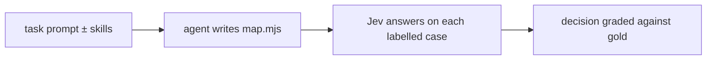

# Evaluations

The skills in this kit tell an agent to measure every Jev map on labelled cases. This page describes how the
skills themselves were measured, what the results were, and what changed because of them.

## Overview

| evaluation | question | size | result |
| --- | --- | --- | --- |
| [The study](#the-study) | Where does Jev win and lose, and why? | 57 suites, 1,836 cases | question wording moved accuracy 30–40 points; Jev +4.8 over a cheap LLM |
| [Design A/B](#design-ab) | Do agents with the skills avoid Jev's traps? | 76 agent runs | 8/8 traps avoided with the plugin, 1/8 without |
| [Accuracy on Jev](#accuracy-on-jev) | Do those maps score better? | 37 maps | not at first; after four new rules, 69.2% → 91.7% |
| [Held-out tasks](#held-out-tasks) | Does it transfer to new tasks and another model? | 53 maps | 84–94% → 97–100% where there was headroom |
| [Rule probes](#rule-probes) | Do the rules hold in other domains? | 10 rules × 3 domains | 7 held, 2 held under their condition, 1 narrowed |
| [Other vendors' models](#other-vendors-models) | Does it work for models other than Claude? | 266 maps, 10 models | wrong decisions fell for every model family |

## How a map is graded

A **map** is the code an agent writes: it builds the state, asks the questions, and turns Jev's answers into a
decision ([interface](../README.md#maps-and-suites)). Every eval after the study grades
whole maps end to end:



Each case ends in one of three outcomes:

- **right:** the decision matches the gold label.
- **wrong:** it doesn't. A wrong decision is acted on, so this rate matters most.
- **abstain:** the map sent the case to a person.

Accuracy is the share of right answers. Coverage is the share of cases decided either way.

Across the program:

- **Bars were pre-registered.** Rubrics, hypotheses and pass bars were committed before any run.
- **Grading was blind** wherever both arms ran.
- **Gold labels were computed by rule** where possible, then audited by an independent model that saw the rule
  and the case, never the label.
- **Held-out suites came first.** They were committed before any agent wrote a map for them. A task later used
  to change the skill is reported as no longer held out.

## The study

57 hand-labelled decision suites (1,836 cases) were run on Jev and a cheap LLM, and seven of them on a frontier
model.

| measure | result |
| --- | --- |
| accuracy on decisions Jev is built for | +4.8 points over a cheap LLM; a tie with a frontier model |
| cost | 20–100× cheaper than the cheap LLM; 200–600× cheaper than the frontier model |
| latency | ~600 ms p50, ~1.05 s p95, against 2.9 s and 10 s |
| malformed output | 0 in ~1,900 calls |
| largest single effect | rewriting one question: 30–40 points |

This is where the rules come from. See [how the rules were derived](rules.md#how-the-rules-were-derived).

## Design A/B

Coding agents got tasks that each hide one trap whose cost the study had measured. They ran with and without
the plugin: 76 runs over seven rounds, graded blind against rubrics committed first.

| trap | with plugin | without |
| --- | ---: | ---: |
| a hidden comparison, or an asked-for action | **8/8** | 1/8 |
| compile several question drafts, score them, pin the winner | **3/3** | 0/3 |
| send the unsure cases to a person instead of allowing them | **19/19** | 7/19 |
| a missing premise, weighing trade-offs, many facts from one document | 14/14 | 14/14 |

The A/B found three gaps in the skills, and each fix was re-tested at 3/3 or better. One gap was guidance
placed in a skill the agent didn't load for that task. The fixes moved or sharpened existing rules rather than
adding new ones. [Raw runs and rubrics](../evals/plugin-ab).

## Accuracy on Jev

The same maps, run through Jev on labelled suites.

| task | no plugin | first plugin | final plugin |
| --- | ---: | ---: | ---: |
| renewal notice: accuracy (wrong) | 69.2% (3.3%) | 56.9% (4.7%) | **91.7% (0%)** |
| CI retry: accuracy (wrong) | 80.0% (20.0%) | 76.1% (1.7%) | **85.6% (3.3%)** |
| culprit log line: accuracy (wrong) | 77.8% (13.3%) | 47.5% (**45.8%**) | **100% (0%)** |

The first plugin made the culprit task worse. Agents applied a ranking rule to a picking task, and filtered
log lines with a regex that dropped the right one. Reading Jev's wrong answers produced four new rules:

| new rule | before → after |
| --- | --- |
| pick one of many with a `choice` | culprit wrong decisions 45.8% → 0% |
| measure a pre-filter's recall, or send everything | right line kept in 5/30 → 30/30 |
| split compound questions | 0.50–0.79 → 0.90–0.94 |
| read dates as year/month/day choices | "on time?" 64–75% → 30/30 |

An independent reviewer (GLM 5.3 Flash) agreed with 88 of the 90 labels. [Suites and results](../evals/plugin-accuracy).

## Held-out tasks

Three tasks the plugin was never built on, with suites committed before any map was written, plus 60
adversarial cases. Two agent models: Claude Code's default model at the time, and Sonnet.

| task | no plugin (normal / hard) | plugin (normal / hard) |
| --- | ---: | ---: |
| reply-exposure | 84–88% / 73–76% | **97–98% / 83–88%** |
| alert-routing | 100% / 100% | 100% / 99–100% |
| expense-review | 92–94% / 86–93% | **97–100% / 97–99%** |

Expense-review first went the wrong way: the plugin made 13.8% wrong decisions on hard cases, against 0%. Two
additions came from it: read a stated number exactly (now part of rule 9), and ask whether an expense
*includes* an excluded item (rule 7). After
them, the default model's maps made 1 wrong decision in 200. Because of those fixes, expense-review no longer
counts as held out. [Details](../evals/heldout/README.md).

## Rule probes

Ten rules were tested outside the tasks they came from. For each, the recommended wording and the wording it
warns against ran on 12 items in each of three new domains, with the truth known by construction. Only Jev
was called. The full table also reports [decisiveness](rules.md#how-the-rules-were-derived): 0 for a 50/50
answer, 1 for a certain one.

| outcome | rules |
| --- | --- |
| held in every domain | 1, 4, 5, 7, 9, 10, 15 |
| held under its condition | 2: naming the field mattered in the two domains where the state held other material |
| | 6: a compound question tied on accuracy, but lost decisiveness when the requirement took reasoning |
| narrowed | 8: two stated values compare fine; a value that must be computed doesn't (9/12 at 0.25) |

[Full table](../evals/rule-probes/README.md).

## Other vendors' models

Five new tasks, pre-registered, with labels audited by GLM 5.3 (119/119). Two kinds of author wrote maps:

- **Claude Code agents**, which can run and fix their map before finishing.
- **Nine other models**, each writing a map in a single API call with the skill text in the system prompt:
  GLM 5.3 and Qwen 3.8 Max on all five tasks, and a seven-model panel on three of them. The panel was GPT-5.6
  Terra, Gemini 3.8 Flash, DeepSeek V4 Pro, Kimi K3, Mistral Medium 3.5, MiniMax M3, and Muse Spark 1.3.

266 maps in total, every one graded on Jev.

**Wrong decisions fell for every author family:**

| author | task | no plugin | plugin |
| --- | --- | ---: | ---: |
| Claude Code agents | SLA breach | 15.6% | **1.1%** |
| Claude Code agents | culprit line | 13.3% | **0%** |
| seven-model panel | SLA breach | 11.4% | **0.6%** |
| seven-model panel | culprit line | 4.3% | **0%** |
| GLM 5.3 and Qwen 3.8 Max | five tasks | 1.8–1.9% | **0–0.2%** |

**The first skill version made other models' maps abstain too often.** GLM's and Qwen's maps gated on questions
about the policy, on guessed thresholds, or on policy clauses re-read for every case. Four changes fixed this:
fit gates per question, never gate on the policy, pin a fixed policy in code, and narrow rule 8. Accuracy on
maps that ran then rose:

| author | no plugin | first version | current version |
| --- | ---: | ---: | ---: |
| GLM 5.3 | 83.6% | 76.2% | **90.7%** |
| Qwen 3.8 Max | 95.3% | 79.7% | **90.8%** |
| Gemini 3.8 Flash | 58.9% | 93.3% | 92.8% |
| DeepSeek V4 Pro | 73.3% | 93.9% | 94.4% |

GLM and Qwen rows cover all five tasks. Gemini and DeepSeek rows cover SLA breach, refunds, and culprit line.
Qwen's maps without the plugin were more accurate than with it, but made 1.9% wrong decisions against 0%.

**Single-call authors lose some maps to unfinished output.** With the skill loaded, maps are about 40% longer,
and some models reasoned past their output or stream limit before writing code:

- 6 of 42 panel maps were unusable with the skill, against 0 without.
- GLM 5.3 produced no code for 5 of 15 maps even with a 64k output budget.
- Claude Code agents, which can run their maps, had none of these failures in 60 maps.

**Access requests are still the weakest task.** Every remaining wrong decision there answers an admin request
with "needs approval" instead of "deny". These errors are cautious, but the plugin isn't ahead on that task.

[Full results, models used, and skill versions](../evals/heldout2/README.md).

## Reproduce

Every evaluation folder has its suites, the maps or runs, the grading scripts, and recorded results.

```bash
# grade any map against a suite
node plugin/skills/jev-eval/scripts/jev-run.mjs evals/heldout2/sla-breach.json --map path/to/map.mjs

# audit recorded results offline, without a key
node plugin/skills/jev-eval/scripts/jev-audit.mjs evals/support-triage/results/jev.jsonl
```

## Limitations

- **One author.** One person wrote the study's suites, labels and rules. Independent LLM relabelling agreed on
  83–89% of the study's labels and 97.8–100% of the plugin suites' labels. No second person has labelled them.
- **Small cells.** Most comparisons use 2–12 maps. Gaps under ~7 points are noise, and re-grading the same
  maps moved accuracy by up to 2.2 points.
- **Some tasks were used for tuning.** expense-review, refund-eligibility and access-request were used to
  change the skill, and are reported as no longer held out.
- **Easy tasks can't discriminate.** alert-routing and clause-locator were near the ceiling with or without the
  plugin.
