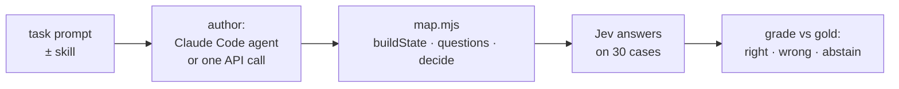

# Second held-out round: new tasks, many authors, four skill versions

> **In short.**
> - Five tasks the skill was never tuned on, pre-registered, 30 cases each, labels audited by GLM 5.3.
> - **10 authoring models, 266 maps, every one graded end to end on Jev.** An author (a Claude Code agent,
>   or another vendor's model in one API call) writes a map. Jev answers its questions on every case, and
>   the map's decisions are graded.
> - **With the skill, wrong decisions fell for every author family:**
>   - Claude Code agents: sla 15.6% → 1.1%, culprit 13.3% → 0%.
>   - The seven-vendor panel: sla 11.4% → 0.6%, culprit 4.3% → 0%.
>   - GLM and Qwen: to 0.0–0.2%.
> - **Skill v3 over-abstained with other vendors.** Maps gated on questions about the policy, or on guessed
>   thresholds. Four fixes (v4 → v4.2) raised accuracy on the maps that ran: GLM 5.3 76% → 91%,
>   Qwen 3.8 Max 80% → 91%. Wrong decisions stayed at about 0. Gemini and DeepSeek were already at 93–94% and
>   stayed there. Gemini's v4.2 maps all ran (v3: 1 in 6 did not).
> - **The cost is output that doesn't finish.** In one call, the longer skill makes some models reason past the
>   output or stream limits. GLM 5.3 wrote no code for 5 of 15 v4.2 maps, even with a 64k budget and a retry.
>   An agent that can run its map (Claude Code) had 0 such failures in 60 maps.

## The loop being tested



A **map** is the file an author writes: what Jev reads, what it is asked, and how the answers become a
decision (see [the map interface](../../plugin/skills/jev-eval/references/suite-format.md)). "Wrong" means a decision that disagrees with the gold label. "Abstain"
means the map deferred to a person.

## Tasks

| task | decision | rules it exercises |
| --- | --- | --- |
| `sla-breach` | was the first-response SLA breached? | 8, 9, 12, 16 |
| `refund-eligibility` | is the requested item returnable? | 7, 8, 9, 10 |
| `access-request` | grant / needs_approval / deny | 6, 12, 15 |
| `clause-locator` | which of 12 sections sets a term? | 10 |
| `culprit` | the log line that states a CI failure's cause | 10, 16 (re-run of item 4) |

Gold is computed by rule in `gen.mjs`. Hypotheses: [PREREGISTRATION.md](PREREGISTRATION.md).

| label reviewer | sla | refund | access | clause |
| --- | ---: | ---: | ---: | ---: |
| `zai/glm-5.3` | 30/30 | 30/30 | 30/30 | 29/29 |
| `alibaba/qwen3.8-max-0902` | 19/30 | 26/30 | 23/30 | 30/30 |

Every Qwen disagreement read was a self-contradiction ("20 minutes past the deadline", then "no"). The labels stand.

## Models used

| role | model | how | maps |
| --- | --- | --- | ---: |
| subject | `typesafe-ai/jev` | systemone API | — |
| author | Claude Code agent (session default) | `run.sh`: `claude -p`, `--plugin-dir` in the plugin arm; can run and fix its map | 30 v3 + 9 v4 + 6 v4.1 + 15 v4.2 |
| author | `zai/glm-5.3` | `author.mjs`: one streamed call, reasoning on, skill in the system prompt | 30 v3 + 15 v4.2 (+ 12 retries) |
| author | `alibaba/qwen3.8-max-0902` | same | 30 v3 + 15 v4.2 |
| author | `deepseek/deepseek-v4-pro`, `google/gemini-3.8-flash` | same | 12 v3 + 10 v4.2 each |
| author | `openai/gpt-5.6-terra`, `moonshotai/kimi-k3`, `mistral/mistral-medium-3.5`, `minimax/minimax-m3`, `meta/muse-spark-1.3` | same | 12 v3 each |
| label reviewers | `zai/glm-5.3`, `alibaba/qwen3.8-max-0902` | `label-audit.ts` | — |

Each API map's `usage.json` records:
- the model id and the provider that served it;
- tokens, time and the output budget;
- the skill hash and git ref.

Each maps folder has a `SKILL_VERSION` file.

| skill | commit | what changed |
| --- | --- | --- |
| v3 | `d0d3e87` | as released after the documentation pass |
| v4 | `7c6cccc` | rule 8 narrowed to computed sides; gates fitted per question; no gating on questions about the policy; a fixed policy's constants pinned |
| v4.1 | `ce3bf53` | pinning moves the coverage check to the author: every clause maps to code, one test per clause |
| v4.2 | `fee41a3` (API maps record `dea04f4`; the skill is identical) | …and that check is the author's, never a question to Jev |

| panel model | mean time per map (v3) | mean output tokens (v3) |
| --- | ---: | ---: |
| gpt-5.6-terra | 44 s | 3,056 |
| gemini-3.8-flash | 84 s | 11,190 |
| kimi-k3 | 75 s | 13,386 |
| muse-spark-1.3 | 142 s | 10,766 |
| minimax-m3 | 172 s | 20,643 |
| deepseek-v4-pro | 181 s | 18,841 |
| mistral-medium-3.5 | 6 s | 1,014 |
| glm-5.3 | 473 s | 30,114 |

## 1. Claude Code agents

Accuracy / wrong decisions, 3 maps per cell (90 cases).

| task | no plugin | v3 | v4 | v4.1 | v4.2 |
| --- | ---: | ---: | ---: | ---: | ---: |
| sla-breach | 60.0% / 15.6% | 93.3% / 1.1% | 91.1% / 0.0% | — | **94.4% / 1.1%** |
| refund-eligibility | 64.4% / 2.2% | 73.3% / 0.0% | 91.1% / 3.3% | 100% / 0% | **100% / 0%** |
| access-request | 84.4% / 0.0% | 92.2% / 2.2% | — | 63.3% / 3.3% | 84.4% / 5.6% |
| clause-locator | 96.7% / 0.0% | 93.3% / 0.0% | — | — | 93.3% / 0.0% |
| culprit | 66.7% / 13.3% | 71.1% / 0.0% | 97.8% / 0.0% | — | 84.4% / 0.0% |

- **Item 4 (culprit, ≤ 5% wrong):** passed with v3 (0/90). v4 fixed v3's guessed gate: 71% → 98%.
- **v4 on refund:** 4 wrong in 90, every one approving a gift card. The maps pinned return windows per category
  but modelled no category exclusion. → v4.1: every clause of a pinned policy must map to code.
- **v4.1 on access:** one map turned that advice into a runtime question to Jev ("does the policy have a clause
  this map does not handle?") and abstained on 23 of 30. → v4.2: the check is the author's, never Jev's.
- **Access-request, still weak.** Every wrong decision in v4.1 and v4.2 is an admin request answered
  needs_approval instead of deny. They came from maps that asked Jev for the decision rather than deriving it
  (rule 12). They lean cautious (never grant), and access is the one task where the plugin is not ahead.
- **Re-run drift:** the v4 maps were graded twice. Jev's answers moved per-task accuracy by up to 2.2 points.
- refund was used to change the skill twice, so its v4.1 and v4.2 rows are no longer held out. sla, clause and
  culprit at v4.2 were not used to change it.

## 2. Other vendors, one API call each

"Loaded" leaves out maps that were never produced or that fail to load or run. "All" counts them as 0.

**Skill v3, three tasks (sla, refund, culprit), 2 maps each per model:**

| | no plugin: loaded accuracy / wrong | plugin: loaded accuracy / wrong | unusable (no plugin → plugin) |
| --- | ---: | ---: | ---: |
| seven-vendor panel, sla | 48.8% / 11.4% | **66.7% / 0.6%** | 0 → 3 of 14 |
| seven-vendor panel, refund | 76.9% / 2.1% | **83.9% / 1.4%** | 0 → 2 of 14 |
| seven-vendor panel, culprit | 70.7% / 4.3% | **81.5% / 0.0%** | 0 → 1 of 14 |

Five tasks, 3 maps each:

| | no plugin: loaded accuracy / wrong | plugin: loaded accuracy / wrong | unusable (no plugin → plugin) |
| --- | ---: | ---: | ---: |
| GLM 5.3 | 83.6% / 1.8% | 76.2% / 0.2% | 0 → 0 of 15 |
| Qwen 3.8 Max | 95.3% / 1.9% | 79.7% / 0.0% | 3 → 4 of 15 |

With v3, the skill removed wrong decisions for every model but lowered GLM's and Qwen's accuracy. Their maps
abstained. On the most-abstaining maps, the least confident question was a question about the policy
("are the holidays machine-readable dates?", "does the policy have pause rules?"). Or it was a guessed 0.8
gate on a choice over many lines, or a policy clause re-read on every case. Those are exactly v4's four changes.

**Skill v4.2 (plugin arm), after one retry at 64k output for maps with no code:**

| model | tasks | maps that ran | loaded accuracy | wrong | v3 plugin, loaded |
| --- | --- | ---: | ---: | ---: | ---: |
| GLM 5.3 | 5 | 10 / 15 | **90.7%** | 0.0% | 76.2% |
| Qwen 3.8 Max | 5 | 13 / 15 | **90.8%** | 0.0% | 79.7% |
| Gemini 3.8 Flash | sla, refund, culprit | 6 / 6 | **92.8%** | 1.1% | 93.3% (77.8% with failures) |
| DeepSeek V4 Pro | sla, refund, culprit | 6 / 6 | 94.4% | 0.0% | 93.9% |

Across all five tasks, Gemini scored 95.0% / 0.7% and DeepSeek 94.0% / 0.0% (10 maps each).

## 3. Why one-shot authors fail more with the skill

| | no plugin | plugin |
| --- | ---: | ---: |
| panel maps unusable (v3) | 0 / 42 | 6 / 42 |
| mean output tokens (panel, v3) | 9,592 | 12,949 |
| mean lines of map code (panel, v3) | 106 | 152 |
| GLM 5.3 maps with no code (v4.2, 32k budget) | — | 9 / 15 |
| …after one retry at 64k | — | 5 / 15 |

- **The maps are bigger.** The skill asks for separate reads, arithmetic in code, abstain options and gates. More
  code means more truncation and more bugs. One panel map loops forever on a business-hours calculation. The
  grader now kills a map after a time limit and records it as failed.
- **One call, no second look.** Reasoning models spend their budget before writing. GLM's empty v4.2 responses
  hit either the 32k output limit or the gateway's maximum stream duration. The hardest task (sla, business-hour
  arithmetic) failed 3 of 3 even at 64k.
- **An author that can run its map does not have this problem.** Claude Code agents had 0 unusable maps in 60.
- 4 of Qwen's v3 failures were empty responses after ~26 minutes, which is a provider stall, not the skill.

**Advice this adds to the plugin README:** give a one-shot author a large output budget, and load and run the map
on one case before trusting it. A map that fails to load is reported by `jev-run`.

## 4. Do design checks predict accuracy?

`design.mjs <maps dir>` loads each map, calls `questions()` on one case and inspects `decide()`, without calling Jev.
On the Claude maps, where both are known (`design_vs_accuracy.py`):

| task | flag | maps with / without | wrong decisions with / without |
| --- | --- | ---: | ---: |
| sla-breach | computes business time in code | 4 / 2 | **1/120** / 14/60 |
| culprit | one `choice` over every line (no pre-filter) | 3 / 3 | **0/90** / 12/90 |
| refund-eligibility | counts days in code | 4 / 2 | 1/120 / 1/60 (accuracy 78% / 50%) |

On the v3 panel, the skill moved these same flags:

| flag | no plugin | plugin |
| --- | ---: | ---: |
| sla maps asking Jev "breached?" directly | 12/14 | **0/12** |
| culprit maps using one `choice` over every line | 6/14 | **13/13** |

## Reproduce

In the published kit, the `maps*/` folders are left out. The `results.*.json` files hold every graded case,
with Jev's answers and each map's decision.

```bash
node gen.mjs                                                  # suites
./run.sh <task> <plugin|base> <rep> [model]                   # a Claude Code author (REPO, OUT env)
MAX_OUTPUT=32000 node --env-file=../../.env.local author.mjs <task> <arm> <model> <rep> <outdir>
node --env-file=../../.env.local grade.mjs <map dirs...> --out results.<name>.json   # isolated, time-limited per map
python3 summarise.py                                          # summary.md, every author × skill × arm
node design.mjs maps-api && python3 design_vs_accuracy.py     # design checks
```

`SKILL_REF=<commit>` makes `author.mjs` read the skill from git at that commit. Node's `fetch` needs
`NODE_USE_ENV_PROXY=1` behind a proxy. The gateway ran out of credit once, mid-round (HTTP 402). `resume.sh` finished
that part with the v3 skill pinned.
