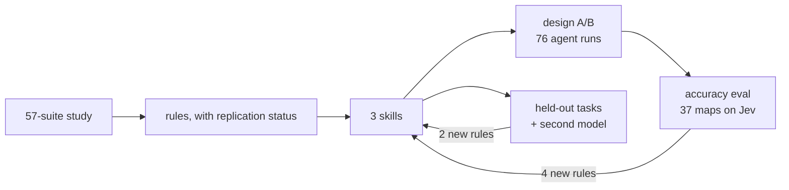

# How this plugin was built, and how we know it works

From a research study of Jev to three skills, and the six rounds of measurement that corrected them.

## In one minute

- **The study** compared Jev with LLMs on 57 hand-labelled decision suites. The biggest effect in it
  was not the model: **rewriting a question moved accuracy 30–40 points**.
- **Those findings became rules** in three skills: whether to use Jev (`jev-fit`), how to ask
  (`jev-questions`), and how to measure (`jev-eval`).
- **A design A/B** showed that agents with the skills avoid Jev-specific traps (8/8 against 1/8).
- **An accuracy eval** then showed that looking right is not scoring right. The first plugin *raised*
  wrong decisions on one task from 13% to 46%. Reading Jev's wrong answers produced the fixes.
- **Held-out tasks and a second agent model** confirmed the gains transfer where tasks are hard, and
  found two more rules.
- **What was built and removed:** a linter, and a hook. Neither earned its place.

## 1. The study

It compared Jev with a cheap LLM on 57 suites, and with a frontier model on seven.

| measure | result |
| --- | --- |
| scale | 57 suites, 1,836 hand-labelled cases, ~3,200 LLM calls, ~1,900 Jev calls |
| accuracy on the decisions Jev is built for | **+4.8 points** over a cheap LLM, **a tie** with a frontier model |
| cost | 20–100× cheaper than the cheap LLM, 200–600× cheaper than the frontier model |
| latency | ~600 ms p50 and ~1.05 s p95, against 2.9 s and 10 s |
| malformed output | 0 in ~1,900 calls |
| largest effect of all | **rewriting one question: 30–40 points** |

**What that means:** the accuracy edge is small, and the economics are the product. How you ask
matters more than which model you ask, so the plugin is mostly about asking well.

The full study: `docs/report.md` in the research repository.

## 2. From findings to rules

Each finding was turned into a rule only after it was tested somewhere other than where it was found.
Five of the study's fourteen original laws failed that test and were rewritten as conditional rules.

| finding | evidence | became (`jev-questions`) |
| --- | --- | --- |
| a judgment missing a fact fails silently | recall 0 at 0.99 confidence; 77.5% → 100% with the fact | rule 1: premise in the state |
| an unscoped question absorbs other state | −28.5 points with no change in confidence | rule 2: name the field |
| the key carries no meaning to Jev | 100% on an LLM, 0% on Jev | rule 4 |
| Jev drops the "if" | 48.7% → 87.2% with the condition in code | rule 5: ask what is true now |
| Jev cannot hold one value against another | 41.7% → 100% comparing in code | rule 8: never ask Jev to compare |
| deriving can help or hurt, by shape | +58 to −34 over twenty measured cases | rule 12: the two-part test |
| the confidence scalar is under-confident | off by up to 29 points; the distribution within ~4 | rule 13: gate on the probability |
| Jev detects manipulation better than it resists it | 5/6 against 3/6 | rule 15: detector question |

A rule that failed replication stayed in, with its condition. "Convert `score` to `choice`" was +20.5
once and −4.0, −2.9, +2.9 elsewhere, so rule 11 says `score` is *fragile*, not *wrong*.

Every rule's evidence and status: [`../skills/jev-questions/references/rules.md`](../skills/jev-questions/references/rules.md).

## 3. Does it change what agents write? The design A/B

**Setup:** coding agents were given tasks that each hide one trap whose cost the study measured, with
and without the plugin. 76 runs over seven rounds, plus 22 testing the hook (section 6), graded
blind against rubrics committed first.

| trap | with plugin | without |
| --- | ---: | ---: |
| hidden comparison, asked-for action | **8/8** | 1/8 |
| compile questions, score drafts, pin the winner | **3/3** | 0/3 |
| escalate the unsure band instead of allowing it | **19/19** | 7/19 |
| premise, weighing, fan-out | 14/14 | 14/14 (no difference) |

**It found three gaps, each fixed and re-tested at 3/3 or better:**
- No warning that causal pointing is weak, because that guidance sat in the wrong skill.
- Every agent, with the plugin or without, decided from an upstream model's extraction instead of the source.
- One agent missed that "on time" is a comparison.

**The lesson:** where a rule sits decides whether an agent applies it. Each fix moved or sharpened
guidance; none added a new idea.

## 4. Does it change what Jev answers? The accuracy eval

**Setup:** the same 37 maps, run through Jev on labelled suites, each through its own decision code.

| task | no plugin | first plugin | final plugin |
| --- | ---: | ---: | ---: |
| renewal notice: accuracy (wrong) | 69.2% (3.3%) | 56.9% (4.7%) | **91.7% (0%)** |
| CI retry: accuracy (wrong) | 80.0% (20.0%) | 76.1% (1.7%) | **85.6% (3.3%)** |
| culprit log line: accuracy (wrong) | 77.8% (13.3%) | 47.5% (**45.8%**) | **100% (0%)**, then 86.7% (13.3%)\* |

\* In a later re-check, two maps picked the failing test's name over the assertion beneath it. Their
rubric allowed it and the gold did not. The independent reviewer accepted it in 5 of 6 cases, and
scored that way both maps reach 29/30. The pre-registered bar still reads as failed.

**Looking right was not scoring right.** The first plugin hurt on culprit, for two reasons:
- **The wrong rule for the job.** Agents used "a `noul` per candidate", a rule measured on
  *ranking*, to *pick one* line. A `noul` is absolute, so the generic "exit code 1" line scored as
  high as the real error.
- **Unmeasured pre-filters.** Agents narrowed the log with a regex and dropped the right line before
  Jev saw it, keeping it in as few as 5 of 30 cases.

**Four rules came from reading Jev's wrong answers** (now rules 6, 9, 10 and 16):

| new rule | before → after |
| --- | --- |
| pick one of many with a `choice` | culprit wrong decisions 45.8% → 0% |
| measure a pre-filter's recall, or send everything | right line kept in 5/30 → 30/30 |
| split compound questions | method question 0.50–0.79 → 0.90–0.94 |
| read dates as year/month/day choices, compute in code | "on time?" 64–75% → 30/30 |

**An independent reviewer** (GLM 5.3 Flash, given the rule and the case, never the label) agreed with
88 of these 90 labels.

## 5. Does it transfer? Held-out tasks and a second model

**Setup:** three tasks the plugin was never built on, with suites committed before any map was
written, plus 60 adversarial cases. Both the default agent model and Sonnet were run. Every map was
graded through the standard interface, with no adapters.

| held-out task | no plugin (normal / hard) | final plugin (normal / hard) |
| --- | ---: | ---: |
| reply-exposure | 84–88% / 73–76% | **97–98% / 83–88%** |
| alert-routing | 100% / 100% | 100% / 99–100% (a ceiling) |
| expense-review | 92–94% / 86–93% | **97–100% / 97–99%** |

**Two more rules came from expense-review**, where the plugin first made *more* wrong decisions (13.8%
against 0% on hard cases):
- **Read a stated number exactly.** One map read "USD 75" as the band 70–75, then called a $73.44
  dinner "ambiguous, so over".
- **Ask "does it include", not "is it a kind".** 12/12 at 0.93–0.98 against 10/12, never decisive.

After them, the default model's expense maps made **1 wrong decision in 200**. With Sonnet, pooled to 7
maps per arm, the plugin made 1.9–2.1% wrong decisions against 0–1.4%, all cautious, at 98% accuracy against
91–95%.

**After the documentation rewrite**, the restructured skill was re-checked against bars set in advance:
expense-review made 1 wrong decision in 150 cases, reply-exposure scored 100% on normal cases, and the
edit-task review flagged the trap 3/3. Nothing the agents relied on was lost.

## 5b. Do the rules hold elsewhere? Rule probes

Each rule's recommended wording and the wording it warns against, on 12 items in each of three new
domains, with truth by construction. Jev only. [Full table](../../evals/rule-probes/README.md).

| outcome | rules |
| --- | --- |
| held in every domain | 1, 4, 5, 7, 9, 10, 15 |
| held under its condition | 2: mattered where the state held other material; 6: a compound question tied, but lost decisiveness where the requirement took reasoning |
| narrowed | 8: two *stated* values compare fine; a side that must be *computed* does not (9/12 at 0.25) |

## 5c. Other authors, other vendors: the second held-out round

Five new tasks, pre-registered, labels audited by `zai/glm-5.3` (119/119). **10 authoring models, 266 maps,
all graded end to end on Jev:** Claude Code agents, plus GLM 5.3, Qwen 3.8 Max and seven other vendors'
models writing each map in one API call. [Full results and a models-used table](../../evals/heldout2/README.md).

| | no plugin | skill v3 | skill v4.2 |
| --- | ---: | ---: | ---: |
| Claude, sla-breach: accuracy / wrong | 60.0% / 15.6% | 93.3% / 1.1% | **94.4% / 1.1%** |
| Claude, culprit: accuracy / wrong | 66.7% / 13.3% | 71.1% / 0.0% | **84.4% / 0.0%** |
| seven-vendor panel, sla: wrong | 11.4% | **0.6%** | — |
| GLM 5.3, five tasks: accuracy on maps that ran / wrong | 83.6% / 1.8% | 76.2% / 0.2% | **90.7% / 0.0%** |
| Qwen 3.8 Max, five tasks: same | 95.3% / 1.9% | 79.7% / 0.0% | **90.8% / 0.0%** |

What it changed in the skill:
- **v3 over-abstained with other vendors.** Their maps gated on questions about the policy, on guessed thresholds,
  or on policy clauses re-read per case. v4 fixed all of these: fit gates per question, never gate on the policy,
  pin a fixed policy's constants, and narrow rule 8 to computed sides.
- **v4 → v4.2, two lessons about pinning.** A pinned policy with no field for an exclusion approved gift-card
  returns, so every clause must map to code. Then an agent turned that check into a question to Jev and abstained
  on 23 of 30, so the check is the author's.

The cost: in one call, a longer skill means longer maps. 6 of 42 panel maps were unusable with the skill
(0 without), and GLM 5.3 wrote no code for 5 of 15 v4.2 maps even at 64k output. Claude Code agents, which
can run their maps, had none.

## 6. What was built and removed

| addition | why it was obvious | what the measurement said | fate |
| --- | --- | --- | --- |
| a linter for question text | the rules look checkable | ~50% recall; flagged fields at 100%; 0 of 7 fixes outside noise | removed |
| a hook injecting a checklist on write | skills may not load during small edits | no effect from scratch (skills alone 4/4); 0/3 on an edit task | redesigned |
| a hook asking for a review on read | same | 3/3 on the edit task | **replaced** by a checklist in the skill, also 3/3 |
| a reasoning-vs-no-reasoning router | route hard cases to reasoning | +0.9 points against a 1.4-point error | not built |

## 7. What the evidence does not show

- **One author** wrote the study's suites, labels and rules. LLM relabelling agreed 83–89% on the
  study and 98% on the plugin suites, but no second person has labelled anything.
- **Small cells.** 3–12 maps per comparison. Gaps under ~7 points are noise.
- **Easy held-out suites.** alert-routing hit the ceiling in both arms, and so cannot discriminate.
- **Tuned on its own tests.** The expense fixes were made on a held-out task, which then stopped being
  held out. reply-exposure and alert-routing never changed the skill.
- **Other vendors, few maps each.** Nine non-Anthropic models wrote maps, 6–45 each. The skill removed wrong decisions for all of them, but one-shot authors lose some maps to unfinished output.

## Where everything is

| what | research repository | kit |
| --- | --- | --- |
| the study | `docs/report.md`, `docs/design-laws.md`, `docs/methodology.md` | — |
| design A/B (rounds 1–14) | `results/experiments/plugin-ab/` | `evals/plugin-ab/` |
| accuracy eval | `results/experiments/plugin-accuracy/` | `evals/plugin-accuracy/` |
| held-out tasks, second model | `results/experiments/heldout/` | `evals/heldout/` |
| rule probes | `results/experiments/rule-probes/` | `evals/rule-probes/` |
| held-out round 2, ten authoring models | `results/experiments/heldout2/` | `evals/heldout2/` |
| policy outcomes (round 3) | `results/experiments/heldout3/` | `evals/heldout3/` |
| a hard task and the latest models (round 4) | `results/experiments/heldout4/` | `evals/heldout4/` |
| pre-registered bars, every round | `rubric.md`, `PREREGISTRATION.md` in the above | same |
